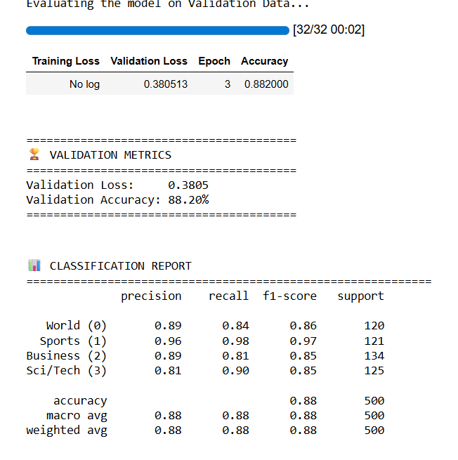
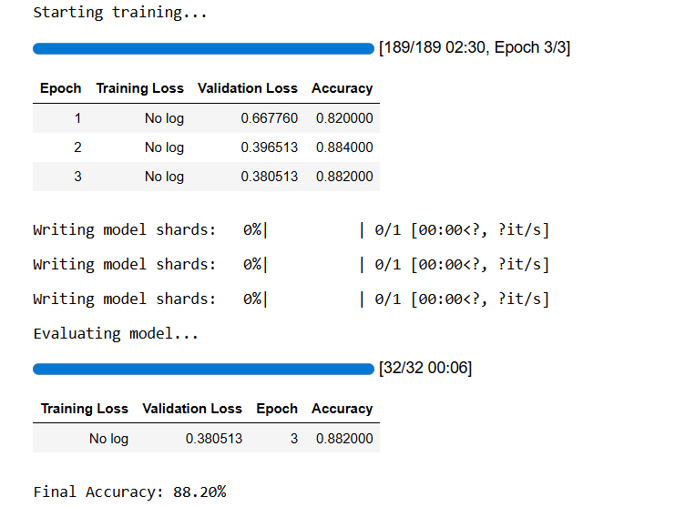
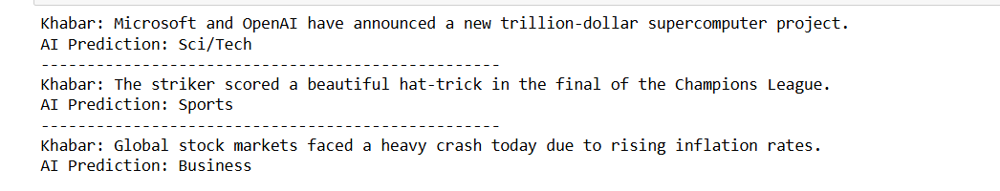

# BERT_News_Classification
A Natural Language Processing (NLP) pipeline using a fine-tuned BERT model to classify news articles into four categories with PyTorch and Hugging Face.

# 📰 Transformer-Based News Classification (BERT)

**Author:** Mohammad Mazhar Fareed

## 📌 Overview
This repository contains a robust Natural Language Processing (NLP) pipeline that leverages a fine-tuned BERT (Bidirectional Encoder Representations from Transformers) model to classify news articles into four distinct categories: World, Sports, Business, and Sci/Tech.

## ⚙️ Key Technical Implementations
* **Frameworks:** PyTorch, Hugging Face `transformers`, and `datasets`.
* **Model Architecture:** `bert-base-uncased` featuring a WordPiece tokenizer and a custom 4-node sequence classification head.
* **Training Parameters:** Fine-tuned over 3 epochs with a learning rate of 2e-5, weight decay of 0.01, and a batch size of 16 using the Hugging Face Trainer API.
* **Hardware Acceleration:** Engineered for PyTorch CUDA execution, enabling optimal feed-forward execution and training on professional AI hardware such as the Nvidia DG SPARK.

## 📂 Repository Structure
* `TRANSFORMER.ipynb`: The primary Jupyter Notebook containing the data pipeline, model initialization, training loop, evaluation metrics, and custom inference script.
* `*.png` files: Visual documentation of the model's performance, metrics, and evaluation results.

---

## 📊 Performance Metrics & Visualizations

The model was empirically evaluated on a held-out test split of the AG News dataset.

### 1. Validation Accuracy and Loss
The model achieved strong convergence over the training lifecycle. The final validation evaluation yielded a high accuracy of **88.20%** with a stabilized validation loss of **0.3805**.

### 2. Classification Accuracy Report
This Scikit-Learn classification report maps the precision, recall, and f1-scores across all four discrete categories, demonstrating the model's balanced capability to distinguish between semantic contexts.

### 3. Custom Inference Testing
The notebook includes a custom PyTorch function to map new raw string inputs directly to the GPU for instant prediction. Below are the results of the model successfully classifying unseen news headlines into their correct respective categories.

